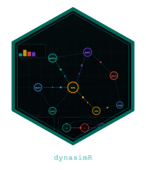

# dynasimR — Dynamic Agent-Node Simulation Analysis 

<!-- badges: start -->
[](https://github.com/rabanheller/dynasimR/actions/workflows/R-CMD-check.yaml)
[](https://lifecycle.r-lib.org/articles/stages.html#experimental)
[](https://opensource.org/licenses/MIT)
<!-- badges: end -->

Analysis and visualization layer for discrete-event, agent-based, and
node-actor simulation outputs. Primary application: **MEDTACS-SIM**
(military tactical casualty simulation) and **REHASIM** (rehabilitation
flow simulation). The package is schema-harmonised so both simulations
can be analysed with the same API.

## Installation

```r
# install.packages("remotes")
remotes::install_github("rabanheller/dynasimR")
```

## Quick start

```r
library(dynasimR)

# 1. Load bundled example data (or point to your simulation output directory)
sim <- load_example_data()
# sim <- read_simulation("~/medtacs-sim/data/raw/")

# 2. Survival analysis
km <- km_estimate(sim, endpoint = "role2", stratify_by = "scenario")
plot_km(km, title = "Survival-to-Role-2")

# 3. Doctrine effect (MUF vs. Military Necessity)
doc <- doctrine_effect(sim, muf_scenario = "M-S08", milnec_scenario = "M-S07")
cat(doc$narrative)  # LaTeX-ready text for manuscript

# 4. Autonomy trade-off
al <- al_efficiency(sim)
plot_al_tradeoff(al)

# 5. Manuscript export
export_latex_table(
  data     = doc$effect_sizes,
  filename = "doctrine_table.tex",
  caption  = "Doctrine effect sizes.",
  label    = "doctrine"
)

# 6. Interactive Shiny dashboard
launch_app()
```

## Feature map

| Research question                           | Key function                  |
|---------------------------------------------|-------------------------------|
| Chain of Resuscitation throughput (RQ1)     | `role_throughput()`           |
| Survival stratified by scenario (RQ2)       | `km_estimate()`, `cox_model()` |
| Doctrine effect MUF vs. MilNec (RQ3)        | `doctrine_effect()`           |
| Autonomy-level trade-off AL0-AL5 (RQ4)      | `al_efficiency()`             |
| IHL Compliance Index                        | `compute_ihl_index()`         |
| REHASIM FIM trajectory                      | `fim_trajectory_analysis()`   |
| Waiting-Gap Index (REHASIM)                 | `compute_waiting_gap_index()` |
| Manuscript placeholder fill                 | `fill_placeholders()`         |

## Requirements

- R >= 4.1.0 (base pipe `|>` used throughout)
- Required imports: dplyr, tidyr, purrr, readr, tibble, ggplot2,
  survival, rlang, cli, glue
- Shiny app requires the `Suggests:` dependencies — install with
  `dynasimR::check_app_dependencies()`

## License

MIT (c) R. Heller
