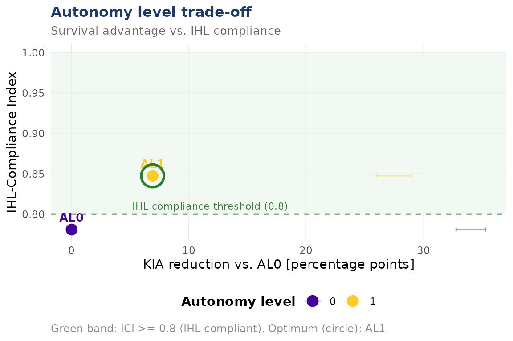

# Autonomy-level trade-off (AL0-AL5)

``` r
library(dynasimR)
sim <- load_example_data()
```

## AL-Efficiency ratio

We trade off KIA reduction versus IHL compliance. The default AL
scenario mapping requires the full MEDTACS-SIM sweep; here we
demonstrate with the two AL points in the shipped example data.

``` r
al <- al_efficiency(
  sim,
  al_scenarios = c("0" = "M-S00", "1" = "M-S01"),
  ihl_threshold = 0.80,
  n_bootstrap   = 200
)
al$tradeoff_table
#> # A tibble: 2 × 10
#>      al scenario kia_median kia_ci_lo kia_ci_hi kia_reduction_pct ihl_index
#>   <int> <chr>         <dbl>     <dbl>     <dbl>             <dbl>     <dbl>
#> 1     0 M-S00         0.341     0.328     0.353              0        0.781
#> 2     1 M-S01         0.272     0.260     0.290              6.91     0.847
#> # ℹ 3 more variables: above_threshold <lgl>, al_ratio <dbl>, n_reps <int>
```

## Trade-off plot

``` r
plot_al_tradeoff(al)
#> `height` was translated to `width`.
```



## Interpretation

The `optimal_al` slot holds the AL level with the highest KIA reduction
while staying above the IHL threshold:

``` r
al$optimal_al
#> [1] 1
```

IHL violations (if any):

``` r
al$ihl_violations
#> # A tibble: 1 × 11
#>      al scenario kia_median kia_ci_lo kia_ci_hi kia_reduction_pct ihl_index
#>   <int> <chr>         <dbl>     <dbl>     <dbl>             <dbl>     <dbl>
#> 1     0 M-S00         0.341     0.328     0.353                 0     0.781
#> # ℹ 4 more variables: above_threshold <lgl>, al_ratio <dbl>, n_reps <int>,
#> #   ihl_deficit <dbl>
```
