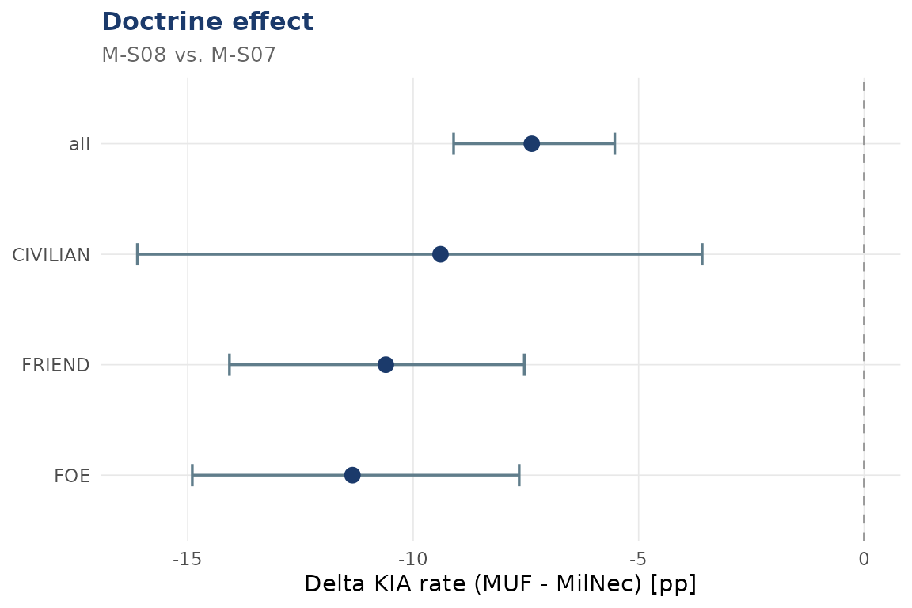

# Doctrine effects: MUF vs. Military Necessity

``` r
library(dynasimR)
sim <- load_example_data()
```

## The core comparison

The two MEDTACS scenarios `M-S07` (Military Necessity) and `M-S08`
(Medical Urgency First) differ only in the triage doctrine applied.

``` r
doc <- doctrine_effect(
  sim,
  muf_scenario    = "M-S08",
  milnec_scenario = "M-S07",
  n_bootstrap     = 500
)
print(doc)
#> 
#> ── dynasimR_doctrine ───────────────────────────────────────────────────────────
#> • MUF: "M-S08"
#> • MilNec: "M-S07"
#> • n (reps): 50
#> 
#> ── Delta KIA ──
#> 
#> # A tibble: 4 × 4
#>   identity median_pct_points  ci_lo ci_hi
#>   <chr>                <dbl>  <dbl> <dbl>
#> 1 all                  -7.37  -9.10 -5.53
#> 2 CIVILIAN             -9.39 -16.1  -3.59
#> 3 FOE                 -11.3  -14.9  -7.65
#> 4 FRIEND              -10.6  -14.1  -7.54
#> ── Narrative ──
#> Under Medical Urgency First doctrine (scenario M-S08), a KIA-rate reduction of 7.4 percentage points (95\%-CI: -9.1 to -5.5) was observed versus prioritisation of own forces (scenario M-S07) (Wilcoxon test: W = 215, p < 0.001). The IHL-Compliance Index was higher under MUF doctrine (0.919 vs. 0.658).
```

## Delta KIA visualisation

``` r
plot_doctrine(doc)
#> `height` was translated to `width`.
```



## Auto-generated narrative

The `narrative` slot is a LaTeX-escaped string ready to drop into a
manuscript:

``` r
cat(doc$narrative)
```

Under Medical Urgency First doctrine (scenario M-S08), a KIA-rate
reduction of 7.4 percentage points (95%-CI: -9.1 to -5.5) was observed
versus prioritisation of own forces (scenario M-S07) (Wilcoxon test: W =
215, p \< 0.001). The IHL-Compliance Index was higher under MUF doctrine
(0.919 vs. 0.658).

## Effect sizes

``` r
doc$effect_sizes
#> # A tibble: 3 × 2
#>   metric                value
#>   <chr>                 <dbl>
#> 1 Cohen_d_KIA         -1.95  
#> 2 Risk_Difference_KIA -0.0685
#> 3 NNT_surrogate       14.6
```
