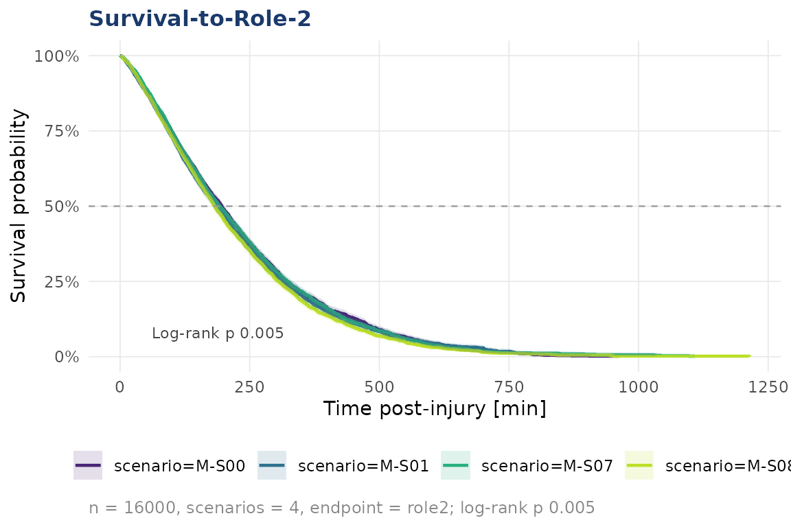
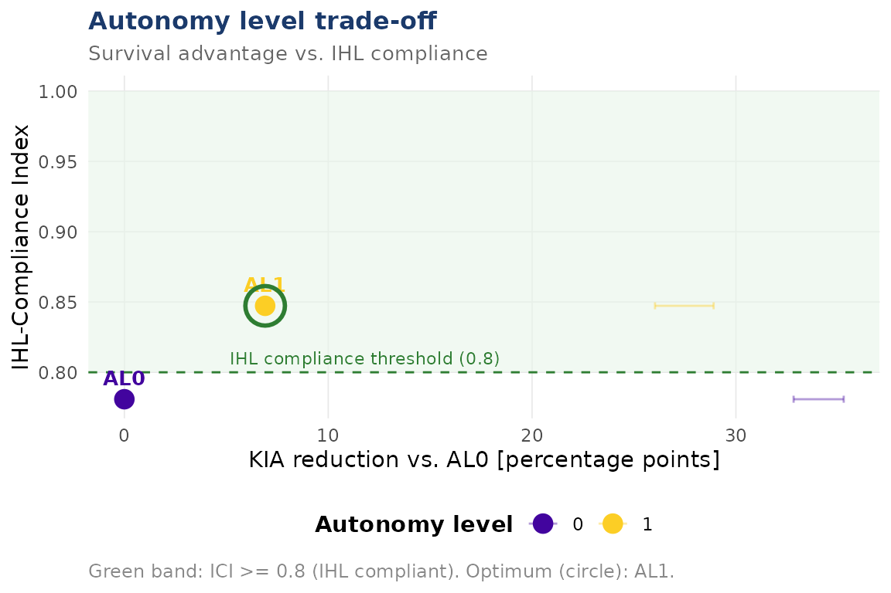

# Getting started with dynasimR

``` r
library(dynasimR)
```

## Load data

``` r
sim <- load_example_data()
print(sim)
#> 
#> ── dynasimR_data ───────────────────────────────────────────────────────────────
#> • Scenarios: 4
#> • Simulation: "MEDTACS"
#> • Summary rows: 200
#> • Casualty events: 16000
#> • Loaded: "2026-04-17 13:37"
#> • Path: /home/runner/work/_temp/Library/dynasimR/extdata
```

## Survival analysis

``` r
km <- km_estimate(sim, endpoint = "role2", stratify_by = "scenario")
plot_km(km, title = "Survival-to-Role-2")
#> Warning: Removed 2 rows containing missing values or values outside the scale range
#> (`geom_ribbon()`).
```



## Doctrine effect

``` r
doc <- doctrine_effect(sim,
  muf_scenario    = "M-S08",
  milnec_scenario = "M-S07",
  n_bootstrap     = 200)
cat(doc$narrative)
#> Under Medical Urgency First doctrine (scenario M-S08), a KIA-rate reduction of 7.4 percentage points (95\%-CI: -9 to -5.6) was observed versus prioritisation of own forces (scenario M-S07) (Wilcoxon test: W = 215, p < 0.001). The IHL-Compliance Index was higher under MUF doctrine (0.919 vs. 0.658).
```

## Autonomy trade-off

Only two AL points are present in the shipped example data, but the
machinery is the same with the full MEDTACS-SIM output.

``` r
al <- al_efficiency(
  sim,
  al_scenarios  = c("0" = "M-S00", "1" = "M-S01"),
  ihl_threshold = 0.80,
  n_bootstrap   = 200
)
plot_al_tradeoff(al)
#> `height` was translated to `width`.
```



## Manuscript-ready export

``` r
export_latex_table(
  data     = doc$effect_sizes,
  filename = "doctrine_table.tex",
  caption  = "Doctrine effect sizes.",
  label    = "doctrine"
)
```

## Launching the dashboard

``` r
launch_app()                                   # example data
launch_app(data_dir = "~/medtacs-sim/data/raw")
```
