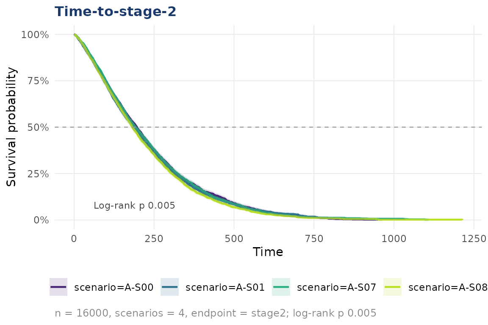
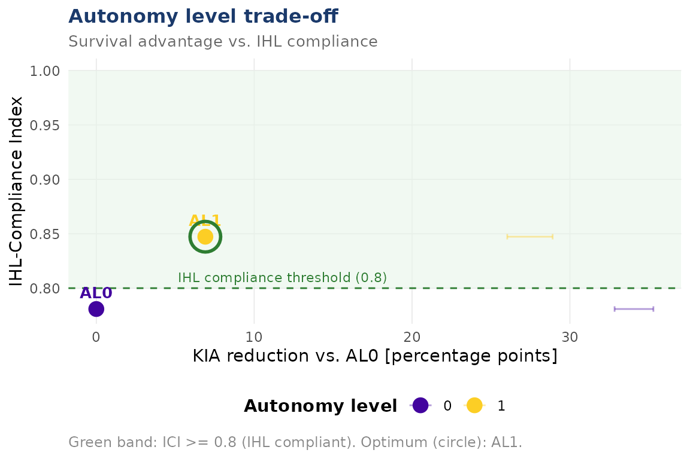

# Getting started with dynasimR

[](https://github.com/CTTIR/dynasimR/actions/workflows/R-CMD-check.yaml)
[](https://cttir.github.io/dynasimR/)
[](https://CRAN.R-project.org/package=dynasimR)
[](https://app.codecov.io/gh/CTTIR/dynasimR?branch=main)
[](https://cran.r-project.org/package=dynasimR)
[](https://cran.r-project.org/package=dynasimR)
[](https://opensource.org/licenses/MIT)
[](https://lifecycle.r-lib.org/articles/stages.html#experimental)

``` r

library(dynasimR)
```

### Load data

``` r

sim <- load_example_data()
print(sim)
#> 
#> ── dynasimR_data ───────────────────────────────────────────────────────────────
#> • Scenarios: 4
#> • Profile: "Profile_A"
#> • Summary rows: 200
#> • Entity events: 16000
#> • Loaded: "2026-08-11 14:34"
#> • Path: /home/runner/work/_temp/Library/dynasimR/extdata
```

### Time-to-event analysis

``` r

km <- km_estimate(sim, endpoint = "stage2",
                  stratify_by = "scenario")
plot_km(km, title = "Time-to-stage-2")
#> Warning: Removed 2 rows containing missing values or values outside the scale range
#> (`geom_ribbon()`).
```



### Policy effect

``` r

pol <- policy_effect(sim,
  policy_a_scenario = "A-S08",
  policy_b_scenario = "A-S07",
  n_bootstrap       = 200)
cat(pol$narrative)
#> Under policy A (scenario A-S08), an event-rate reduction of 7.4 percentage points (95\%-CI: -9 to -5.6) was observed versus policy B (scenario A-S07) (Wilcoxon test: W = 215, p < 0.001). The Compliance Index was higher under policy A (0.919 vs. 0.658).
```

### Autonomy trade-off

Only two AL points are present in the shipped example data, but the
machinery is the same for a full AL sweep.

``` r

al <- al_efficiency(
  sim,
  al_scenarios         = c("0" = "A-S00", "1" = "A-S01"),
  compliance_threshold = 0.80,
  n_bootstrap          = 200
)
plot_al_tradeoff(al)
#> `height` was translated to `width`.
```



### Manuscript-ready export

``` r

export_latex_table(
  data     = pol$effect_sizes,
  filename = "policy_table.tex",
  caption  = "Policy effect sizes.",
  label    = "policy"
)
```

### Launching the dashboard

``` r

launch_app()                                        # example data
launch_app(data_dir = "~/my-simulation/data/raw")
```

## Use of LLM tools

Portions of this package were prepared with assistance from large
language model tooling for narrowly defined, non-authorial tasks:
copyediting, prose smoothing, Markdown/LaTeX formatting, scaffolding of
boilerplate files (CI configs, build scripts), code refactoring. The
tools used were [Chat
AI](https://kisski.gwdg.de/leistungen/2-02-llm-service/), the LLM
service of KISSKI (GWDG), and a self-hosted **Mistral Small (24B,
Apache-2.0)** run locally via [Ollama](https://ollama.com/) and the
`ollamar` R package — local inference only, with no data sent to third
parties for the self-hosted model.

All scientific claims, methodological choices, analyses,
interpretations, and conclusions are the author’s own. No LLM-generated
text was incorporated without review and revision, and every reference
was verified against its DOI, arXiv ID, or ISBN.
