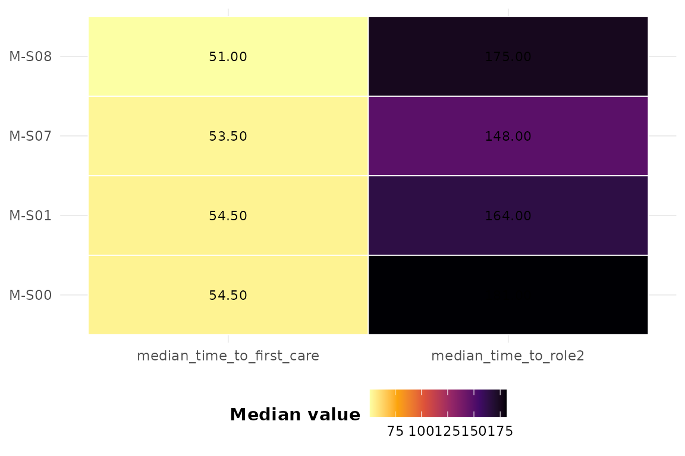

# Patient flow analysis

The chain of resuscitation moves casualties through Role-1 (point of
injury) to Role-4 (definitive care). This vignette shows how to quantify
throughput and identify bottlenecks.

``` r
library(dynasimR)
sim <- load_example_data()
```

## Role throughput

``` r
rt <- role_throughput(sim)
rt
#> # A tibble: 4 × 7
#>   scenario role      n median_min   q25   q75 completed_frac
#>   <chr>    <chr> <int>      <dbl> <dbl> <dbl>          <dbl>
#> 1 M-S00    Role2  4000        153    77  258              NA
#> 2 M-S01    Role2  4000        145    74  253              NA
#> 3 M-S07    Role2  4000        151    80  259              NA
#> 4 M-S08    Role2  4000        151    77  259.             NA
```

Only `Role2` (time_to_role2) is present in the shipped example, but the
machinery generalises to Role1..Role4 when the columns exist in your
simulation output.

## Bottleneck detection

``` r
detect_bottlenecks(rt, threshold = 0.75)
#> # A tibble: 1 × 8
#>   scenario role      n median_min   q25   q75 completed_frac is_bottleneck
#>   <chr>    <chr> <int>      <dbl> <dbl> <dbl>          <dbl> <lgl>        
#> 1 M-S00    Role2  4000        153    77   258             NA TRUE
```

## Visualising first-care times

``` r
plot_scenario_heatmap(
  sim,
  metrics = c("median_time_to_first_care",
              "median_time_to_role2")
)
```


