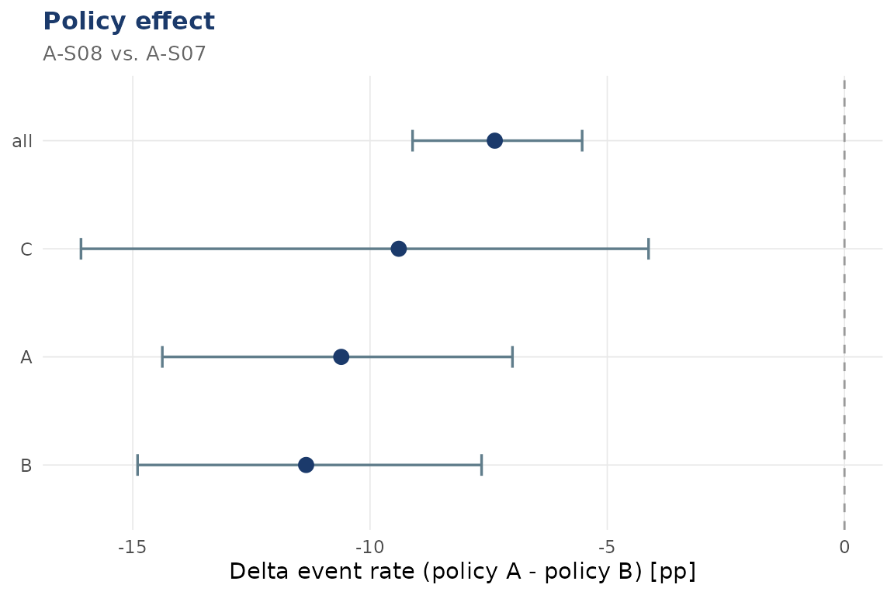

# Policy effects: Policy A vs. Policy B

``` r
library(dynasimR)
sim <- load_example_data()
```

## The core comparison

The two Profile A scenarios `A-S07` (policy B) and `A-S08` (policy A,
priority by severity) differ only in the allocation policy.

``` r
pol <- policy_effect(
  sim,
  policy_a_scenario = "A-S08",
  policy_b_scenario = "A-S07",
  n_bootstrap       = 500
)
print(pol)
#> 
#> ── dynasimR_policy ─────────────────────────────────────────────────────────────
#> • Policy A: "A-S08"
#> • Policy B: "A-S07"
#> • n (reps): 50
#> 
#> ── Delta event rate ──
#> 
#> # A tibble: 4 × 4
#>   group median_pct_points  ci_lo ci_hi
#>   <chr>             <dbl>  <dbl> <dbl>
#> 1 all               -7.37  -9.10 -5.53
#> 2 A                -10.6  -14.4  -7.00
#> 3 B                -11.3  -14.9  -7.65
#> 4 C                 -9.39 -16.1  -4.13
#> ── Narrative ──
#> Under policy A (scenario A-S08), an event-rate reduction of 7.4 percentage points (95\%-CI: -9.1 to -5.5) was observed versus policy B (scenario A-S07) (Wilcoxon test: W = 215, p < 0.001). The Compliance Index was higher under policy A (0.919 vs. 0.658).
```

## Delta event-rate visualisation

``` r
plot_policy(pol)
#> `height` was translated to `width`.
```



## Auto-generated narrative

The `narrative` slot is a LaTeX-escaped string ready to drop into a
report:

``` r
cat(pol$narrative)
```

Under policy A (scenario A-S08), an event-rate reduction of 7.4
percentage points (95%-CI: -9.1 to -5.5) was observed versus policy B
(scenario A-S07) (Wilcoxon test: W = 215, p \< 0.001). The Compliance
Index was higher under policy A (0.919 vs. 0.658).

## Effect sizes

``` r
pol$effect_sizes
#> # A tibble: 3 × 2
#>   metric                  value
#>   <chr>                   <dbl>
#> 1 Cohen_d_event         -1.95  
#> 2 Risk_Difference_event -0.0685
#> 3 NNT_surrogate         14.6
```
